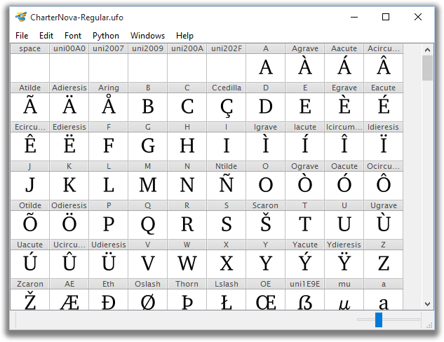

# TruFont

TruFont is a font-editing application written with Python3, ufoLib, defcon and PyQt.

## Dependencies

<<<<<<< e682dcfc62e917d6b603140cffcede18209609fd
- [Python 3]
- [PyQt5]
- [fontTools]
- [robofab, python3-ufo3 branch]
- [defcon, python3-ufo3 branch]
- [ufo2fdk, python3-ufo3 branch] (optional)
=======
- Python 3
- PyQt5
- cython & [booleanOperations]
- [fontTools]
- [robofab, python3-ufo3 branch]
- [defcon, python3-ufo3 branch]

Optional:

- [extractor, python3-ufo3 branch]
- [ufo2fdk, python3-ufo3 branch]
>>>>>>> README: update

## Run

Install: `python setup.py install && trufont`

<<<<<<< e682dcfc62e917d6b603140cffcede18209609fd
`cd Lib && python3 -m defconQt`

Useful:
=======
Virtualenv: `cd Lib && python -m defconQt`

## Install notes
>>>>>>> README: update

* [INSTALL.md] 
* [CONTRIBUTING.md]
* [LICENSING.md] 

<<<<<<< e682dcfc62e917d6b603140cffcede18209609fd
[Python 3]: https://www.python.org
[PyQt5]: riverbankcomputing.com/software/pyqt
=======
[booleanOperations]: https://github.com/typemytype/booleanOperations
>>>>>>> README: update
[fontTools]: https://github.com/behdad/fonttools
[robofab, python3-ufo3 branch]: https://github.com/trufont/robofab
[defcon, python3-ufo3 branch]: https://github.com/trufont/defcon
[extractor, python3-ufo3 branch]: https://github.com/trufont/extractor
[ufo2fdk, python3-ufo3 branch]: https://github.com/trufont/ufo2fdk
[INSTALL.md]: https://github.com/trufont/trufont/blob/master/INSTALL.md
[CONTRIBUTING.md]: https://github.com/trufont/trufont/blob/master/CONTRIBUTING.md
[LICENSING.md]: https://github.com/trufont/trufont/blob/master/LICENSING.md
